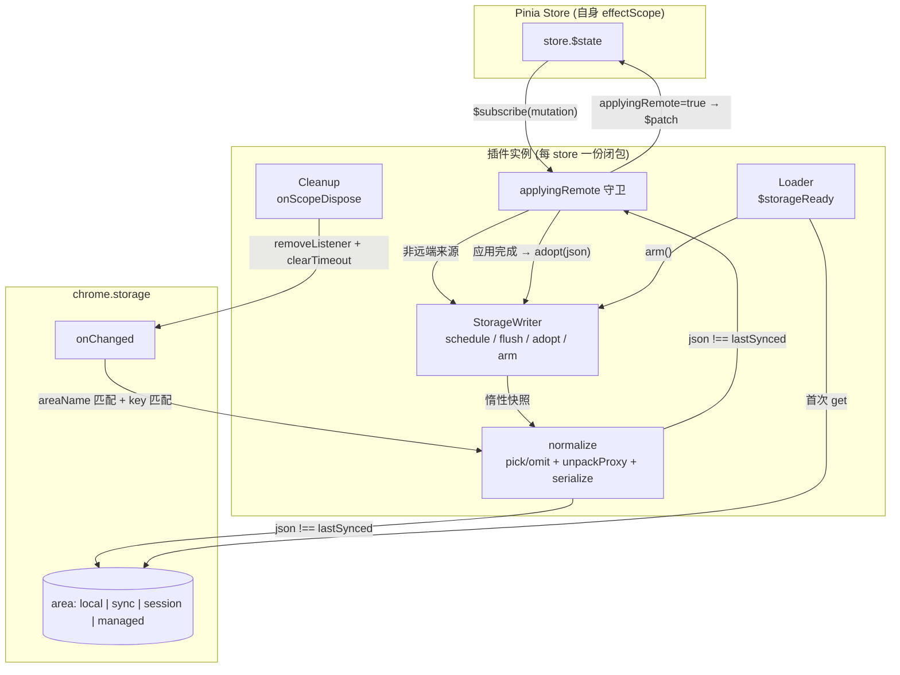
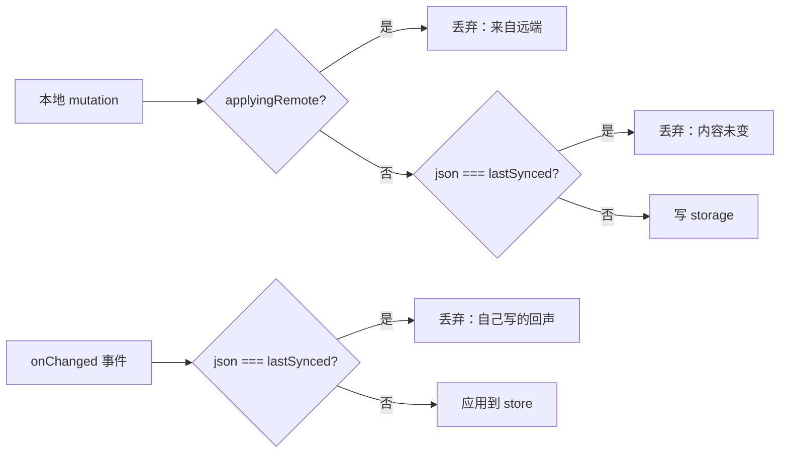
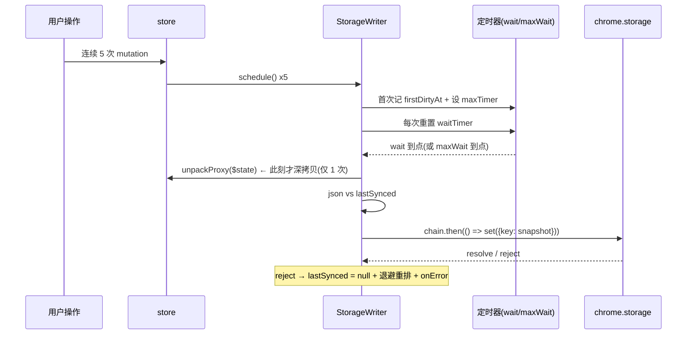
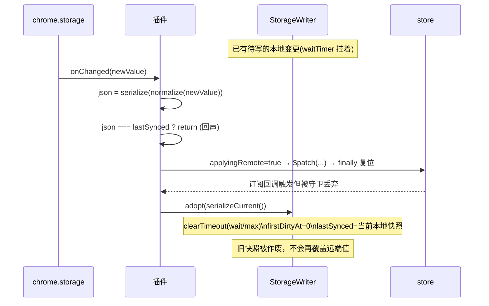
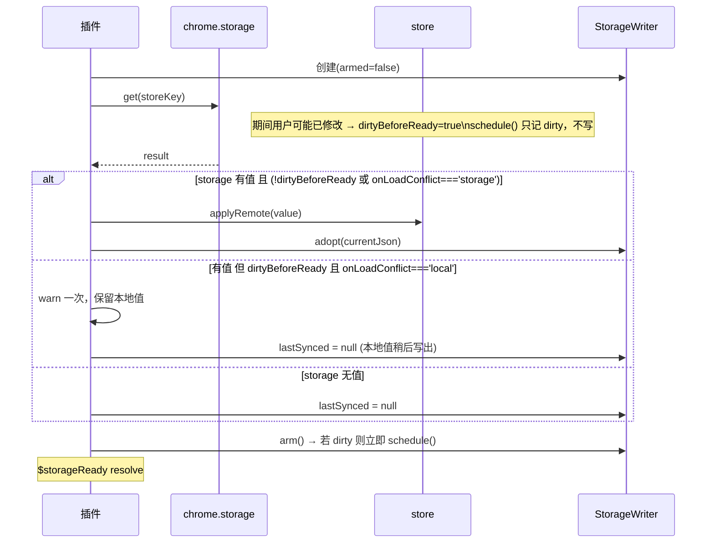

# 设计文档：chrome-storage-sync-hardening

## 概述

本设计对 `src/piniaChromeStoragePlugin.ts` 做加固重写，目标是消除现有实现中的**丢更新**、**跨 store 状态串扰**、**监听器泄漏**、**Symbol 标记残留导致持久化静默失效**、**写失败静默丢数据** 五类正确性缺陷，同时把「防循环同步」的机制从「往响应式 state 里塞 Symbol 标记」换成「闭包内同步布尔守卫 + 内容级去重」这一双层方案。

核心机制取舍已定：**方案 A（同步布尔守卫）为主，方案 B（内容级去重 `lastSynced`）为自终止兜底**，节流保留但改造为「带 `maxWait` 上界、按 store 隔离、可 flush」的 throttle。方案 A 依赖 Pinia v3 `$patch` 同步触发订阅这一内部行为，方案 B 不依赖任何框架内部行为，因此即使 A 在未来版本失效，最多多写一轮就自然收敛，不可能出现无限回环。

对外 API 保持向后兼容：`piniaChromeStoragePlugin(options)` 调用形态不变，现有 `storage` / `prefix` 语义不变，新增选项全部可选且带按区域区分的默认值。

---

## 设计目标与非目标

### 目标

1. 任何情况下不因插件自身机制丢失用户更新（远端更新被旧快照覆盖、写失败静默丢弃、节流窗口内上下文销毁）。
2. 防循环同步不依赖写入响应式 state 的任何标记，不存在「标记残留 → 持久化永久失效」的失败模式。
3. 每个 store × 每个插件实例拥有独立的写入器状态，互不干扰、互不饥饿。
4. store 销毁时释放 `chrome.storage.onChanged` 监听器与定时器。
5. 写失败（尤其 `sync` 配额 rejection）可被观测，并具备重试路径。
6. 文档注释与实现一致（删除不存在的「Proxy 懒加载」说法）。

### 非目标（本期不做，见「开放决策点」）

1. 多上下文并发写的乱序/冲突消解（方案 C：`writerId` + `rev` 信封）。
2. 字段级增量同步（当前仍是整 store 快照写入）。
3. 跨浏览器（`browser.*` / WebExtension polyfill）兼容层。
4. `Date` / `Map` / `Set` 的完整往返序列化（本期只做「显式告警 + 不静默毁坏」）。

---

## 现有缺陷与对策映射

| # | 缺陷 | 后果 | 本设计对策 |
|---|------|------|-----------|
| 1 | mutation 时立即深拷贝进 `pendingStorageUpdate`，50ms 后才写；期间收到的远端更新会被这份旧快照覆盖并广播回去 | 丢更新（最严重） | **惰性快照**：定时器到点时才 `unpackProxy(store.$state)`；`adopt()` 在应用远端值时清定时器并作废待写内容 |
| 2 | `pendingStorageUpdate` / `storageUpdateTimer` 是模块级共享 | 同时注册 local + sync 两实例时写错区域；高频 store 让其他 store 饥饿 | 状态全部收进 `createWriter()` 闭包，按「store × 插件实例」隔离；纯 debounce 改为带 `maxWait` 的 throttle |
| 3 | 插件返回清理函数无效（返回值被 `assign(store, ...)`，函数无自有可枚举属性），监听器永不移除 | 监听器泄漏、store 重建后叠加 | 用 `onScopeDispose()` 清理（插件在 store 自己的 effectScope 内执行）；另暴露 `$stopStorageSync()` |
| 4 | `SYNC_STORAGE_KEY` Symbol 真的落到响应式 state 上，靠订阅回调 `delete` 清理 | 一次清理漏跑 → 标记永久残留 → 之后所有 `patch function`（含 `$reset`）被误判，持久化静默失效 | **彻底移除 Symbol**，改用闭包内 `applyingRemote` 布尔守卫；不写 state、不依赖 `mutation.type` 与 payload 形状 |
| 5 | `chromeStorage.set` 在 MV3 返回 Promise，同步 `try/catch` 接不住；`pendingStorageUpdate` 已先清空 | 写失败静默丢数据（`sync` 配额错误正是 rejection） | `set()` 纳入 promise chain 并 `.catch()`；失败时 `lastSynced = null` 以便重试，并走退避重排 + `onError` 回调 |
| 6 | `validateStorageArea` 放行只读的 `managed` | 写必然失败 | `managed` 进入**只读模式**（只 load + 监听 `onChanged`，不注册写路径），而非抛错，保持向后兼容 |
| 7 | `load()` 未被等待、无就绪信号；注释声称的 Proxy 懒加载不存在 | 与早期本地修改竞争、可能互相覆盖；注释与实现不符 | 暴露 `$storageReady: Promise<void>`；load 完成前写入器不解锁（`armed = false`），load 后按 `onLoadConflict` 仲裁；重写注释 |
| 8 | `unpackProxy` 把 `Date` / `Map` / `Set` 变成 `{}` | 静默毁坏数据 | `unpackProxy` 改为可识别不支持类型并上报；默认「告警 + 跳过该键」，并提供 `serializer` 逃生口 |

---

## 架构



### 双层防循环机制



第一层（`applyingRemote`）在同一 tick 内精确拦截；第二层（`lastSynced`）与框架无关，即使第一层失效也最多多走一轮即收敛。

---

## 关键时序

### 写方向：throttle + 惰性快照 + 串行化



### 读方向：立即应用 + adopt 作废待写内容（缺陷 1 的正面修法）



### 启动：load 门控与仲裁



---

## 组件与接口

### 组件 1：`normalizeState` / `serialize`（规范化层）

**职责**：把响应式 state 或远端 `newValue` 归一成「可比较、可写入」的普通对象与字符串，保证写方向与读方向用完全相同的规范化路径，否则 `lastSynced` 比较不成立。

```ts
/** 规范化结果：普通对象 + 其序列化字符串 */
interface Normalized {
  snapshot: Record<string, any>
  json: string
  /** 遇到无法安全序列化的值时收集的顶层键名 */
  droppedKeys: string[]
}

interface StateSerializer {
  serialize(snapshot: Record<string, any>): string
  deserialize(json: string): Record<string, any>
}

function normalize(
  raw: Record<string, any>,
  filter: KeyFilter,
  serializer: StateSerializer
): Normalized
```

**职责细分**：

- 应用 `pick` / `omit` 顶层键过滤。
- 调用改造后的 `unpackProxy` 解包 Proxy，并识别 `Date` / `Map` / `Set` / `RegExp` / 函数 / `Symbol` 值等不可安全序列化的类型。
- 调用 `serializer.serialize` 得到 `json`。

### 组件 2：`StorageWriter`（写入器，每 store 一份）

**职责**：节流、去重、惰性快照、串行化写入、失败退避、flush、adopt。

```ts
interface StorageWriter {
  /** 标记 dirty 并按 throttle 策略排期；armed=false 时只记 dirty */
  schedule(): void
  /** 立即写出（供 visibilitychange / pagehide / $flushStorage 使用） */
  flush(): Promise<void>
  /** 应用远端值后调用：清定时器、作废待写内容、更新 lastSynced */
  adopt(json: string | null): void
  /** load 完成后解锁写路径 */
  arm(): void
  /** 清理定时器 */
  dispose(): void
}

function createWriter(config: WriterConfig): StorageWriter
```

**内部状态（全部在闭包内，按 store 隔离）**：`waitTimer`、`maxTimer`、`firstDirtyAt`、`dirty`、`armed`、`lastSynced`、`chain`、`retryCount`。

### 组件 3：`RemoteApplier`（远端应用器）

**职责**：`onChanged` 回调的处理与 `applyingRemote` 守卫的持有者。

```ts
/** 将远端快照应用到 store，期间抑制写回 */
function applyRemote(snapshot: Record<string, any>): void
```

**责任**：

- 判定 `areaName` 与 `storeKey` 是否匹配。
- 回声判定（`json === lastSynced` → 直接 return）。
- 置 `applyingRemote = true`，`store.$patch(fn)`，`finally` 复位。
- 按 `syncRemoval` 决定是否删除远端不存在的本地键。
- 应用完成后 `writer.adopt(当前本地快照的 json)`。

### 组件 4：`Lifecycle`（生命周期）

**职责**：注册/注销 `chrome.storage.onChanged`、注册/注销 `visibilitychange` 与 `pagehide`、`onScopeDispose` 统一清理，并保证清理幂等。

### 组件 5：插件返回值（挂到 store 上的属性）

```ts
interface StorageStoreExtensions {
  /** storage 首次加载完成的信号；永不 reject（失败也 resolve，错误经 onError 上报） */
  $storageReady: Promise<void>
  /** 立即写出待写内容；返回的 Promise 在 set 完成后 resolve */
  $flushStorage(): Promise<void>
  /** 手动停止同步并释放监听器与定时器（幂等） */
  $stopStorageSync(): void
}
```

配合 Pinia 类型增强：

```ts
declare module 'pinia' {
  // eslint-disable-next-line @typescript-eslint/no-unused-vars
  export interface PiniaCustomProperties {
    $storageReady: Promise<void>
    $flushStorage(): Promise<void>
    $stopStorageSync(): void
  }
}
```

---

## 数据模型

### 选项（向后兼容扩展）

```ts
export type StorageArea = 'local' | 'sync' | 'session' | 'managed'

export interface PiniaChromeStorageOptions {
  /** 存储区域，默认 'local'。'managed' 为只读模式（只读取与监听，不写入） */
  storage?: StorageArea
  /** 存储键前缀，默认 '' */
  prefix?: string

  /** ↓ 以下为新增，全部可选 */

  /** 节流的静默等待时长(ms)。false 表示不节流，每次 mutation 立即写。
   *  默认：local/session = 150，sync = 1000 */
  debounce?: number | false
  /** 从首次 dirty 起的写出上界(ms)，消除饥饿并给陈旧度确定边界。
   *  默认：local/session = 500，sync = 5000。会被规范化为 >= debounce */
  maxWait?: number

  /** 只持久化这些顶层键 */
  pick?: string[]
  /** 排除这些顶层键（与 pick 同时给出时，先 pick 再 omit） */
  omit?: string[]

  /** 远端快照缺少某顶层键时，是否删除本地对应键。默认 false（合并语义，保护 schema 演进） */
  syncRemoval?: boolean

  /** load 完成前已有本地修改时的仲裁：'local' 保留本地，'storage' 用远端覆盖。默认 'local' */
  onLoadConflict?: 'local' | 'storage'

  /** 自定义序列化（如需稳定键序或支持 Date/Map/Set 往返） */
  serializer?: StateSerializer

  /** 是否在 visibilitychange(hidden) / pagehide 时 flush。默认 true（仅在有 document 的上下文生效） */
  flushOnHide?: boolean

  /** 统一错误出口。未提供时退化为 console.error */
  onError?: (error: unknown, context: StorageErrorContext) => void
}

export interface StorageErrorContext {
  storeId: string
  storeKey: string
  area: StorageArea
  phase: 'load' | 'write' | 'apply' | 'serialize'
}
```

**验证规则**：

- `storage` 必须是四个合法值之一，否则抛错（与现状一致）。
- `debounce` 为数字时必须 `>= 0`；`maxWait` 若小于 `debounce` 则取 `debounce`。
- `pick` / `omit` 只作用于顶层键；两者都给出时先 `pick` 再 `omit`。
- `storage === 'managed'` 时忽略所有写相关选项，并 `console.info` 提示进入只读模式。

### 存储结构

```ts
// chrome.storage[area] 中的形态（本期不引入信封，保持与现有数据完全兼容）
{
  [`${prefix}${store.$id}`]: { /* 过滤后的 state 普通对象快照 */ }
}
```

> 若未来引入方案 C，结构将变为 `{ __v: 1, writerId, rev, data }`，需要迁移逻辑。本期保持裸快照，读取时对两种形态都可容忍是 C 阶段的任务。

---

## 关键函数与形式化规格

### `createWriter(config): StorageWriter`

```ts
function createWriter(config: {
  set: (snapshot: Record<string, any>) => Promise<void>
  readCurrent: () => Normalized       // 惰性快照：调用时才 unpackProxy + serialize
  wait: number
  maxWait: number
  onError: (e: unknown) => void
}): StorageWriter
```

**前置条件**

- `readCurrent()` 无副作用，且每次调用返回调用时刻的最新状态。
- `wait >= 0`，`maxWait >= wait`。
- `set` 返回的 Promise 在写入落地或失败后 settle。

**后置条件**

- `schedule()` 返回后，`dirty === true`；若 `armed === true` 且 `wait > 0`，则存在一个将在 `<= maxWait - (now - firstDirtyAt)` 内触发的定时器。
- 任一次实际写出后，`lastSynced === 该次写出内容的 json`（除失败路径，见下）。
- 写失败后 `lastSynced === null`，且已通过 `onError` 上报。
- `dispose()` 后不再存在活动定时器；重复调用无副作用。

**循环/时序不变式**

- **I1（单飞行）**：任意时刻至多有一个未 settle 的 `set` 调用在 `chain` 上飞行；后续写入按 `schedule` 顺序串行追加，因此落地顺序 == 排队顺序。
- **I2（陈旧度上界）**：从首次 `dirty` 到写出发起的时间 `<= maxWait`（由独立的 `maxTimer` 保证，不依赖后续 mutation 触发）。
- **I3（快照新鲜度）**：写出的快照是 `set` 发起时刻的 state，而非 `schedule` 时刻的 state。
- **I4（去重自终止）**：连续两次写出的 json 必不相同；因此「写 → onChanged 回声 → 判定相同 → 丢弃」链条最多传播一轮。

### `applyRemote(snapshot): void`

**前置条件**

- `snapshot` 是已通过 `normalize` 的普通对象（非 Proxy、非 `undefined`）。
- 调用发生在 store 仍存活（scope 未 dispose）时。

**后置条件**

- `store.$state` 的每个 `snapshot` 顶层键取值等于 `snapshot` 对应值。
- `syncRemoval === true` 时，`snapshot` 中不存在的顶层键已从 `$state` 删除；否则保留原值。
- 返回后 `applyingRemote === false`（`finally` 保证，即使 `$patch` 抛错）。
- 本次应用不产生任何 storage 写入。
- `writer` 的待写内容已作废，`lastSynced` 等于应用后本地快照的 json。

**不变式**

- **I5（无标记污染）**：`$state` 中不存在任何插件写入的 Symbol 或元数据键。
- **I6（守卫平衡）**：`applyingRemote` 只在 `applyRemote` 内为 `true`，且进入次数与复位次数相等。

### `load(): Promise<void>`

**前置条件**：`writer.armed === false`。

**后置条件**

- `writer.armed === true`。
- 若 storage 有值且仲裁为 `storage` 方向，则本地 state 已被应用且 `lastSynced` 已设置。
- 若仲裁为 `local` 方向或 storage 无值，则 `lastSynced === null`（保证本地内容会被写出）。
- 若 load 期间有本地 mutation，`arm()` 后已触发一次 `schedule()`。
- 无论成功失败均 resolve（错误经 `onError` 上报），避免未处理 rejection。

---

## 算法伪码

### 主流程

```pascal
ALGORITHM installPlugin(options, context)
INPUT: options ∈ PiniaChromeStorageOptions, context ∈ PiniaPluginContext
OUTPUT: extensions ∈ StorageStoreExtensions

BEGIN
  ASSERT chromeEnvironmentAvailable() = true
  ASSERT isValidArea(options.storage) = true

  storeKey    ← options.prefix + context.store.$id
  readOnly    ← (options.storage = 'managed')
  applyingRemote ← false
  disposed    ← false

  writer ← createWriter(...)          // readOnly 时为 noop writer

  // 1. 写方向：仅非只读区域注册
  IF NOT readOnly THEN
    unsubscribe ← store.$subscribe(() =>
      IF applyingRemote OR disposed THEN RETURN
      writer.schedule()
    )
  END IF

  // 2. 读方向：始终注册
  onChanged ← (changes, areaName) =>
    IF areaName ≠ options.storage THEN RETURN
    IF storeKey ∉ changes THEN RETURN
    handleRemoteChange(changes[storeKey])
  chrome.storage.onChanged.addListener(onChanged)

  // 3. flush 逃生口
  IF NOT readOnly AND options.flushOnHide AND documentExists() THEN
    document.addEventListener('visibilitychange', onHide)
    window.addEventListener('pagehide', onHide)
  END IF

  // 4. 生命周期清理（插件运行在 store 自身 effectScope 内）
  onScopeDispose(cleanup)

  ready ← load()                       // 不 await，但存入 $storageReady

  RETURN { $storageReady: ready, $flushStorage: writer.flush, $stopStorageSync: cleanup }
END
```

**前置条件**：运行于 Chrome 扩展环境且 `chrome.storage` 可用。
**后置条件**：store 上新增三个扩展属性；scope dispose 后不再持有任何监听器与定时器。

### 写入器排期

```pascal
ALGORITHM schedule()
BEGIN
  IF disposed THEN RETURN
  dirty ← true
  IF NOT armed THEN RETURN            // load 未完成，只记 dirty

  IF wait = 0 THEN
    write()                           // debounce: false
    RETURN
  END IF

  IF firstDirtyAt = 0 THEN
    firstDirtyAt ← now()
    maxTimer ← setTimeout(write, maxWait)      // 上界，只设一次
  END IF

  IF waitTimer ≠ NULL THEN clearTimeout(waitTimer)
  waitTimer ← setTimeout(write, wait)
END
```

**不变式**：`firstDirtyAt ≠ 0 ⟺ maxTimer ≠ NULL`；两者同时被 `clearTimers()` 复位。

> 与会话中展示的骨架的唯一差异：骨架把 `maxWait` 判断放在 `schedule()` 入口做惰性检查，其上界依赖「下一次 mutation 到来」才生效。此处改为独立 `maxTimer`，使不变式 I2 无条件成立。其余结构与骨架保持一致。

```pascal
ALGORITHM write()
OUTPUT: promise
BEGIN
  clearTimers()                        // waitTimer / maxTimer / firstDirtyAt
  dirty ← false

  normalized ← readCurrent()           // 惰性：此刻才 unpackProxy + serialize
  IF normalized.droppedKeys ≠ ∅ THEN warnOnce(normalized.droppedKeys)

  IF normalized.json = lastSynced THEN RETURN resolved()   // 内容级去重
  lastSynced ← normalized.json

  chain ← chain
    .THEN(() => set({ [storeKey]: normalized.snapshot }))
    .THEN(() => retryCount ← 0)
    .CATCH((err) =>
      lastSynced ← NULL                // 不把失败当成已同步
      onError(err, phase: 'write')
      scheduleRetryWithBackoff()       // 1s,2s,4s,8s,16s 上限 5 次
    )
  RETURN chain
END
```

**后置条件**：成功 → `lastSynced` 等于已落地内容；失败 → `lastSynced = NULL` 且已排期退避重试。

### 远端变更处理

```pascal
ALGORITHM handleRemoteChange(change)
INPUT: change ∈ { oldValue?, newValue? }
BEGIN
  IF disposed THEN RETURN
  IF change.newValue = NULL THEN RETURN          // 删除事件本期不处理（见开放决策点）

  incoming ← normalize(change.newValue)
  IF incoming.json = lastSynced THEN RETURN      // 自己那次写的回声

  applyingRemote ← true
  TRY
    store.$patch((state) =>
      FOR each key IN keys(incoming.snapshot) DO
        state[key] ← incoming.snapshot[key]
      END FOR

      IF syncRemoval THEN
        FOR each key IN keys(state) DO
          IF key ∉ keys(incoming.snapshot) THEN delete state[key]
        END FOR
      END IF
    )
  FINALLY
    applyingRemote ← false
  END TRY

  writer.adopt(readCurrent().json)               // 作废旧待写内容 + 更新 lastSynced
END
```

**循环不变式**（应用循环）：每次迭代结束后，已处理的键在 `state` 中的值与 `incoming.snapshot` 一致，未处理键保持原值。

> `adopt` 传入的是「应用后的本地快照」而不是 `incoming.json`。当 `syncRemoval = false` 且本地存在远端没有的新字段时，两者不同；用本地快照做基线可避免「本地立刻把补全字段写回去 → 对端再写回来」的乒乓写，代价是 storage 中保持旧 schema 直到下一次真实本地变更。

### 加载与仲裁

```pascal
ALGORITHM load()
BEGIN
  TRY
    result ← await chromeStorage.get(storeKey)
    IF storeKey ∈ result AND result[storeKey] ≠ NULL THEN
      IF dirty AND onLoadConflict = 'local' THEN
        warnOnce('本地已有修改，跳过 storage 覆盖')
        writer.adopt(NULL)                       // lastSynced = NULL → 本地值稍后写出
      ELSE
        applyRemoteSnapshot(result[storeKey])     // 复用 handleRemoteChange 的应用逻辑
      END IF
    ELSE
      writer.adopt(NULL)
    END IF
  CATCH err
    onError(err, phase: 'load')
  FINALLY
    writer.arm()                                 // 解锁；若 dirty 则内部立即 schedule()
  END TRY
END
```

---

## 参考实现骨架（TypeScript）

```ts
function createWriter(cfg: {
  storeKey: string
  set: (data: Record<string, any>) => Promise<void>
  readCurrent: () => Normalized
  wait: number
  maxWait: number
  onError: (e: unknown) => void
}) {
  let waitTimer: ReturnType<typeof setTimeout> | null = null
  let maxTimer: ReturnType<typeof setTimeout> | null = null
  let firstDirtyAt = 0
  let dirty = false
  let armed = false
  let disposed = false
  let lastSynced: string | null = null
  let chain: Promise<unknown> = Promise.resolve()
  let retryCount = 0

  const clearTimers = () => {
    if (waitTimer) { clearTimeout(waitTimer); waitTimer = null }
    if (maxTimer) { clearTimeout(maxTimer); maxTimer = null }
    firstDirtyAt = 0
  }

  const write = (): Promise<unknown> => {
    clearTimers()
    if (disposed) return chain
    dirty = false

    const { snapshot, json } = cfg.readCurrent()   // 惰性快照
    if (json === lastSynced) return chain          // 内容级去重
    lastSynced = json

    chain = chain
      .then(() => cfg.set({ [cfg.storeKey]: snapshot }))
      .then(() => { retryCount = 0 })
      .catch((err) => {
        lastSynced = null                          // 失败 ≠ 已同步
        cfg.onError(err)
        scheduleRetry()
      })
    return chain
  }

  const scheduleRetry = () => {
    if (disposed || retryCount >= 5) return
    const delay = Math.min(1000 * 2 ** retryCount, 60_000)
    retryCount += 1
    dirty = true
    waitTimer = setTimeout(write, delay)
  }

  const schedule = () => {
    if (disposed) return
    dirty = true
    if (!armed) return
    if (cfg.wait === 0) { void write(); return }

    if (!firstDirtyAt) {
      firstDirtyAt = Date.now()
      maxTimer = setTimeout(() => { void write() }, cfg.maxWait)
    }
    if (waitTimer) clearTimeout(waitTimer)
    waitTimer = setTimeout(() => { void write() }, cfg.wait)
  }

  return {
    schedule,
    flush: () => write().then(() => undefined),
    adopt: (json: string | null) => { clearTimers(); dirty = false; lastSynced = json },
    arm: () => { armed = true; if (dirty) schedule() },
    dispose: () => { disposed = true; clearTimers() },
  }
}
```

---

## 使用示例

```ts
import { createPinia } from 'pinia'
import { piniaChromeStoragePlugin } from 'pinia-chrome-storage'

const pinia = createPinia()

// 1) 现有调用形态完全不变（默认值已按区域调优）
pinia.use(piniaChromeStoragePlugin({ storage: 'local', prefix: 'my-app-' }))

// 2) sync 区域：更长的节流 + 字段过滤 + 错误上报
pinia.use(piniaChromeStoragePlugin({
  storage: 'sync',
  debounce: 1000,
  maxWait: 5000,
  omit: ['transientUiState'],
  onError: (err, ctx) => reportToTelemetry(ctx.phase, err),
}))

// 3) 等待首次加载完成后再渲染依赖持久化数据的界面
const settings = useSettingsStore()
await settings.$storageReady

// 4) 关键数据在敏感时机手动 flush
await settings.$flushStorage()
```

---

## 正确性属性

*属性是指在系统所有合法执行下都应成立的特征或行为——一条关于「系统应当做什么」的形式化陈述。属性是人类可读规格与机器可验证正确性保证之间的桥梁。*

> 引用格式为 `**Validates: Requirements X.Y**`，指向 `requirements.md` 中的验收标准编号。方案 B 只对属性 1、2、4、8、10 写自动化测试，其余属性的验证方式见「测试策略」中的「未被自动化测试覆盖的属性」。

### 属性 1：远端应用不触发写回

*对于任意* store 状态与任意远端快照，把该远端快照应用到 store 的过程中不产生任何 `chrome.storage.set` 调用。

**Validates: Requirements 1.1, 1.5, 10.4**

### 属性 2：回声不被重新应用

*对于任意* 由本插件写出的快照，其引发的 `onChanged` 事件不会导致该 store 的状态发生变化。

**Validates: Requirements 1.2, 8.5**

### 属性 3：去重自终止

*对于任意* mutation 序列，连续两次实际写出的序列化内容必不相同；因此「写 → 回声 → 判定 → 丢弃」链条的传播长度有限（≤ 1 轮），不存在无限同步回环。

**Validates: Requirements 1.3, 1.4**

### 属性 4：远端更新不被旧快照覆盖

*对于任意* 「本地变更已排期但未写出 → 收到远端更新」的交错序列，最终写入 storage 的内容都不等于收到远端更新之前的那份本地快照。

**Validates: Requirements 2.1, 2.2, 2.3, 2.4**

### 属性 5：陈旧度上界

*对于任意* mutation 序列，从首次 dirty 到发起写入的时间间隔不超过 `maxWait`。

**Validates: Requirements 3.1, 3.2, 3.6**

### 属性 6：无饥饿与无串扰

*对于任意* 两个 store 的任意交错 mutation 序列，其中一个 store 的持续高频变更不影响另一个 store 在 `maxWait` 内写出；且每个 store 的数据只写入其自身配置的存储区域与键。

**Validates: Requirements 3.8, 3.9, 11.4, 11.6**

### 属性 7：写入顺序 == 排期顺序

*对于任意* 写入排期序列，`chrome.storage.set` 的发起顺序与排期顺序一致（promise chain 串行化）。

**Validates: Requirements 4.1**

### 属性 8：写失败不被当作已同步

*对于任意* 失败的写入，失败后 `lastSynced` 为 `null`，且下一次排期一定会重新发起写入。

**Validates: Requirements 4.2, 4.3, 4.5**

### 属性 9：state 无元数据污染

*对于任意* 同步操作序列，`store.$state` 的自有键集合（含 Symbol 键）不包含任何插件引入的键。

**Validates: Requirements 12.1, 12.2, 12.3**

### 属性 10：清理幂等且彻底

*对于任意* 次数的 `$stopStorageSync()` / scope dispose 调用组合，调用后不存在残留的 `onChanged` 监听器与活动定时器，且重复调用不抛错。

**Validates: Requirements 5.1, 5.2, 5.3, 5.4**

### 属性 11：字段过滤一致性

*对于任意* state 与任意 `pick` / `omit` 组合，写出的快照顶层键集合恰为过滤规则允许的键集合，且过滤是幂等的。

**Validates: Requirements 8.1, 8.2, 8.3, 8.4**

### 属性 12：合并语义保留未知键

*对于任意* 远端快照与本地 state，当 `syncRemoval = false` 时，远端快照中不存在的本地顶层键在应用后保持原值。

**Validates: Requirements 10.1, 10.2, 10.3**

---

## 需求覆盖回查

对 `requirements.md` 的每条验收标准做反向检查，确认它被某条属性、某个方案 B 测试、或明确的人工验证手段覆盖。「无属性对应」的条目均给出原因，不留悬空。

| 需求条目 | 覆盖属性 | 方案 B 自动化测试 | 无属性对应的条目及原因 |
|---------|---------|------------------|---------------------|
| 1.1–1.5 | 属性 1、属性 3 | T1、T2、T3 | 1.6 是实现结构约束（不读 `mutation.type` / payload），无可观测输入输出，靠代码审查 |
| 2.1–2.4 | 属性 4 | T4、T5 | — |
| 3.1–3.9 | 属性 5、属性 6 | 无 | 3.3、3.4（区域默认参数）、3.5（`debounce: false`）、3.6、3.7（负值抛错）是具体取值与校验分支，属示例/边界而非属性；本期以常量表与代码审查确认 |
| 4.1–4.8 | 属性 7、属性 8 | T6、T7 | 4.4（重试计数复位）随 T6 顺带；4.6（默认 `console.error` 且不打印快照）、4.7（配额提示文案）是日志内容约束；4.8（不引入模块级限流器）是结构约束，均靠代码审查 |
| 5.1–5.5 | 属性 10 | T8 | 5.5（返回属性对象而非函数）由 T1–T8 的公共 setup 隐式覆盖——拿不到 `$stopStorageSync` 就写不出 T8 |
| 6.1–6.9 | 无直接属性 | 无（setup 中 `await $storageReady` 隐式依赖 6.1、6.2、6.4） | 6.3、6.5、6.6、6.7、6.8 是加载路径的具体分支，属示例/边界；6.9（store 级仲裁粒度）是设计取舍陈述。本期靠代码审查 + 手工验证（清空 storage / 预置旧值 / 注入 `get` reject 三种启动路径各跑一次） |
| 7.1–7.5 | 无 | 7.3 由测试在 node 环境运行隐式覆盖（无 `document` 不抛错） | 7.2 需要 `document`，方案 B 明确不引入 jsdom，改为在扩展 popup 中手工验证；7.1、7.4 为具体 API 行为；7.5 为文档要求 |
| 8.1–8.5 | 属性 11 | 无（8.5 由 T3 间接覆盖：读写共用规范化路径是回声可被识别的前提） | 8.5 本身是结构约束 |
| 9.1–9.6 | 无 | 无 | **本期 12 条属性未包含序列化安全**：方案 B 不新增属性。9.1–9.3 的验证方式是人工构造含 `Date` / `Map` / `Set` / `RegExp` / 函数 / Symbol 值的 state，确认对应顶层键被跳过、告警列出键名、storage 中不出现 `{}`；9.4、9.5 为具体分支；9.6 为文档要求。若后续升级到方案 A，应补一条「不支持类型不被静默毁坏」的属性 |
| 10.1–10.4 | 属性 12、属性 1 | T1、T5 间接覆盖 10.4 | — |
| 11.1–11.6 | 属性 6（11.4、11.6） | 无（T1–T8 对 `set` 参数的断言顺带确认键名与区域） | 11.1、11.2（工厂阶段抛错）、11.3（`managed` 只读）、11.5（`storeKey` 不匹配）是校验与分支，属示例/边界，靠代码审查与手工验证 |
| 12.1–12.3 | 属性 9 | 无 | 本期无自动化，靠 grep + DevTools 检查 `Object.getOwnPropertySymbols(store.$state)` |
| 13.1–13.7 | 无 | 13.1、13.2、13.3 由 T1–T8 隐式覆盖（全部以旧调用形态构造、断言 `set` 参数为裸快照、不传新增选项） | 13.4–13.7 是迁移记录，属**纯文档类**要求，靠本文档「向后兼容与迁移」表与 README 审查 |
| 14.1–14.3 | 无 | 无 | 纯文档/注释类要求，靠代码审查（grep「Proxy」「懒加载」）与 README 审查 |
| 15.1–15.6 | 无 | 由测试套件自身满足 | 测试基础设施与元要求，运行 `npm test` 成功、测试清单与属性编号对照即通过 |

---

## 错误处理

| 场景 | 触发条件 | 响应 | 恢复 |
|------|---------|------|------|
| 非扩展环境 | `chrome` 或 `chrome.storage` 不存在 | 插件工厂阶段抛错（与现状一致，属调用方配置错误） | 无（需调用方修正） |
| 非法存储区域 | `storage` 不在四个合法值内 | 工厂阶段抛错 | 无 |
| `managed` 只读 | `storage === 'managed'` | 进入只读模式，`console.info` 一次，不注册写路径 | 读取与监听照常工作 |
| 写入 rejection（通用） | `set()` reject | `lastSynced = null`，`onError(phase: 'write')` | 指数退避重试（1/2/4/8/16s，最多 5 次） |
| 写入 rejection（配额） | `sync` 区域超 `MAX_WRITE_OPERATIONS_PER_MINUTE` / `_PER_HOUR` / `QUOTA_BYTES` | 同上；配额类错误额外提示应调大 `debounce` 或缩减持久化字段 | 退避重试；字节配额类错误重试无益，`onError` 明确告知 |
| 读取失败 | `get()` reject | `onError(phase: 'load')`，`$storageReady` 仍 resolve | store 保留默认值；后续 `onChanged` 仍可同步 |
| 应用远端值抛错 | `$patch` 内部抛错 | `finally` 复位守卫，`onError(phase: 'apply')` | 守卫不会卡死；下一次远端变更可正常处理 |
| 不可序列化值 | state 含 `Date` / `Map` / `Set` / `RegExp` / 函数 | 该顶层键被跳过并 `warnOnce` 列出键名 | 数据不被静默毁坏为 `{}`；用户可配 `serializer` 自行处理 |
| 上下文销毁 | popup 失焦 / 页面卸载 | `visibilitychange(hidden)` 与 `pagehide` 同步调用 flush | **局限：flush 内 `set` 仍是异步的，不能 100% 保证在上下文销毁前发出**；MV3 service worker 无可靠 suspend 钩子（`onSuspend` 不保证触发）。关键数据应缩短 `debounce`，而非依赖 flush 兜底 |

---

## 测试策略（已决定：方案 B - 最小）

**决策**：采用方案 B。只写示例化单元测试，数量 6–8 个，覆盖正确性属性 **1、2、4、8、10**。不引入 `fast-check`，本期不做属性化测试。

### 手段

- **假定时器**：`jest.useFakeTimers()`，用 `jest.advanceTimersByTimeAsync(ms)` 推进，以便在同一测试内既推进 `waitTimer` / `maxTimer` / 退避定时器，又让 promise chain 有机会 settle。
- **内存版 `chrome.storage` mock**：手写一个 fake，挂到 `globalThis.chrome`，能力要求：
  - 四个区域各自一份内存 `Map`，`get` / `set` / `remove` 返回 Promise；
  - `onChanged.addListener` / `removeListener`，并暴露测试侧的「手动广播」入口，可指定 `areaName` 与 `changes`，用于模拟另一个上下文的写入（不经过本插件）；
  - 可注入失败：让下一次（或后续 N 次）`set` / `get` 返回 reject，用于验证退避与 `lastSynced = null`；
  - 可断言：记录 `set` 调用的次数、顺序与参数快照，用于验证「远端应用期间零写入」与「不写出过期快照」；
  - `removeListener` 后监听器数量可被读取，用于验证清理彻底。
- **测试环境**：`testEnvironment: 'node'`。方案 B 覆盖的 5 条属性都不需要 `document`；插件对 `flushOnHide` 的 `document` 存在性检查在 node 环境下自然走「跳过注册」分支，不会报错。

### 测试清单（6–8 个）

| # | 测试 | 覆盖属性 |
|---|------|---------|
| T1 | 应用远端快照期间 `set` 调用次数为 0（远端应用不触发写回） | 属性 1 |
| T2 | `$patch` 在应用远端值时抛错后守卫仍复位，下一次远端变更可正常处理 | 属性 1 |
| T3 | 本插件写出后广播回声 `onChanged`，store 状态与写出前完全一致（回声不被重新应用） | 属性 2 |
| T4 | 本地变更已排期未写出 → 收到远端更新 → 推进定时器：storage 内容不等于收到远端更新前的本地快照 | 属性 4 |
| T5 | 远端更新到达后再发生一次本地变更，写出的是含远端值的新快照（`adopt` 后基线正确） | 属性 4 |
| T6 | 注入 `set` reject：`onError` 被调用（`phase: 'write'`），退避到点后重新发起写入 | 属性 8 |
| T7 | 写失败后不做去重跳过（同一内容会被重写），证明失败未被当作已同步 | 属性 8 |
| T8 | `$stopStorageSync()` 连续调用 3 次不抛错；调用后 `onChanged` 监听器数为 0、无活动定时器、后续 mutation 不产生 `set` | 属性 10 |

### 未被自动化测试覆盖的属性

以下属性**本期没有自动化测试**，不要视为已覆盖。它们的正确性依赖代码审查与手工验证：

| 属性 | 未覆盖原因 | 人工验证方式 |
|------|-----------|-------------|
| 属性 3：去重自终止 | 需要随机 mutation / 远端事件交错序列才有说服力，属性化测试范围 | 代码审查确认 `write()` 中「`json === lastSynced` → return」在 `lastSynced` 赋值之前执行；扩展中打开两个上下文（popup + options）交替修改同一 store，在 `set` 处加临时日志，确认写入不自增长 |
| 属性 5：陈旧度上界 | 需要覆盖任意 mutation 时序，示例化测试只能验证个别点位 | 代码审查确认 `maxTimer` 是独立定时器且只在 `firstDirtyAt === 0` 时设置一次、只在 `clearTimers()` 中清除；手工：持续拖动一个绑定 store 的滑块，观察 storage 值在 `maxWait` 内更新 |
| 属性 6：无饥饿与无串扰 | 需要两个 store 的交错序列与两个插件实例，示例化成本高于收益 | 代码审查确认 `createWriter` 闭包内无模块级变量、`storeKey` 与区域取自各自配置；手工：同时注册 `local` 与 `sync` 两个实例，检查两个区域的键与内容互不混入 |
| 属性 7：写入顺序 == 排期顺序 | 需要控制多个未 settle 的 `set` 的交错完成顺序，属性化/并发测试范围 | 代码审查确认所有 `set` 都经 `chain = chain.then(...)` 追加，无旁路直接调用 `set` |
| 属性 9：state 无元数据污染 | 本期不写测试（原实现的 Symbol 已整体移除，风险主要在实现阶段不再引入） | 代码审查：全仓 grep `Symbol(`、`SYNC_STORAGE_KEY`，确认无对 `state` 的元数据写入；手工在 DevTools 中检查 `Object.getOwnPropertySymbols(store.$state)` 为空 |
| 属性 11：字段过滤一致性 | 需要遍历 `pick` / `omit` 组合空间，属性化测试范围 | 代码审查确认过滤只在 `normalize` 一处实现、写方向与读方向共用；手工：配 `pick` / `omit` 后检查 storage 中的顶层键集合 |
| 属性 12：合并语义保留未知键 | 与 `syncRemoval` 的组合矩阵适合属性化测试 | 代码审查确认删除分支仅在 `syncRemoval === true` 下执行；手工：用旧 schema 快照手动写入 storage，确认 store 上的新增字段仍在 |

### 测试框架选型：复用现有 jest + ts-jest

**结论**：用 `jest` + `ts-jest`，不引入 `vitest`。

**理由**：

1. `package.json` 的 devDependencies 已声明 `jest@^29.5.0`、`ts-jest@^29.1.0`、`@types/jest@^29.5.0`，且已实际安装（`node_modules/.bin/jest`、`node_modules/.bin/ts-jest` 存在）。缺的只是配置文件、测试目录与 `test` 脚本。为 6–8 个测试再引入一套 runner 属于净增依赖。
2. **无 ESM 障碍**：`tsconfig.json` 是 `module: "commonjs"`；`pinia` 的 `exports` 提供了 `require` 条件（`./index.js` / `dist/pinia.cjs`），`vue` 同样有 CJS 入口。ts-jest 的默认 CJS 转换可直接工作，不需要 `--experimental-vm-modules`、不需要 `extensionsToTreatAsEsm`。这是 vitest 的主要优势在本仓库不成立的地方。
3. **假定时器无障碍**：jest 29 的 modern fake timers（基于 `@sinonjs/fake-timers`，已随 jest 安装）支持 `advanceTimersByTimeAsync`，足以驱动「定时器 → promise chain → 断言」的混合时序。
4. **`chrome` 全局 mock 无障碍**：`chrome` 只是一个全局对象，在 `beforeEach` 里赋 `globalThis.chrome = createChromeMock()` 即可；不需要 vitest 的 `vi.stubGlobal`。方案 B 不需要 jsdom（`jest-environment-jsdom` 未安装，jest 29 也不再默认捆绑），因此选 node 环境即可，无需新增依赖。

**需要新增的配置与脚本**：

```js
// jest.config.js（新增）
module.exports = {
  preset: 'ts-jest',
  testEnvironment: 'node',
  roots: ['<rootDir>/tests'],
  testMatch: ['**/*.test.ts'],
  clearMocks: true,
}
```

```jsonc
// package.json（新增脚本）
"scripts": {
  "test": "jest",
  "test:watch": "jest --watch"   // 仅供本地手动运行
}
```

另需把 `tests/**` 排除在 `tsc` 构建之外——现有 `tsconfig.json` 的 `include` 是 `["src/*.ts"]`，已天然排除，无需改动；但 ts-jest 会用同一份 `tsconfig`，若出现 `include` 相关告警，则新增 `tsconfig.test.json`（`extends` 主配置、`include` 加上 `tests`）并在 jest 配置的 `transform` 中指向它。

**一处环境事实需要处理**：`package.json` 声明 peer `pinia@^3.0.1`，但 `package-lock.json` 与 `node_modules` 中实际安装的是 `pinia@2.3.1`（作为 peer 被装进去的旧解析结果）。设计中「依据的 Pinia v3 内部行为」结论 1（`$patch` 同步触发订阅）是方案 A 的前提，若测试跑在 2.3.1 上就没有验证到目标版本。实施时应先把锁文件刷新到 `pinia@^3`（或显式加 `pinia@^3` 到 devDependencies），再写测试。

tasks 阶段会把测试子任务标记为可选（`*`），可随时跳过。

---

## 性能考量

- **写次数**：`local` 无写频配额，但每次 `set` 都是跨进程 IPC + 落盘 + 向所有上下文广播 `onChanged`，会反复唤醒 service worker；`sync` 有硬配额 `MAX_WRITE_OPERATIONS_PER_MINUTE = 120`（平均 500ms 一次）与 `MAX_WRITE_OPERATIONS_PER_HOUR = 1800`，超出即 reject。因此 `sync` 的 `debounce` 必须 `> 500ms`，默认取 1000ms。
- **深拷贝次数**：改为惰性快照后，一个节流窗口内 N 次 mutation 的成本从「N 次深拷贝 + 1 次写」降为「1 次深拷贝 + 1 次写」。深拷贝与序列化都是 O(state 大小)。
- **去重收益**：`lastSynced` 消除内容相同的重复写（典型来源：远端回声、`$reset` 到已持久化的默认值、UI 反复设置同值）。但它消除不了「内容每次都不同的高频写」（计数器、拖滑块、逐字符输入），所以节流必须保留。
- **读方向不做防抖**：`onChanged` 到达立即应用，延迟只会放大冲突窗口。
- **默认参数**：`local` / `session` → `debounce: 150, maxWait: 500`；`sync` → `debounce: 1000, maxWait: 5000`。现状硬编码的 50ms 对 `local` 偏小（几乎不合并），对 `sync` 是危险的。

---

## 安全考量

- 不引入任何网络传输，数据始终留在 `chrome.storage`。
- `sync` 区域会经 Google 账号跨设备同步，**不应存放凭据、令牌等敏感数据**；新增的 `omit` / `pick` 选项正好用于把敏感字段排除在持久化之外。README 中需补充这条提示。
- `managed` 区域由企业策略下发，只读；插件进入只读模式可避免「扩展试图篡改策略」这类误用。
- 错误日志经 `onError` 统一出口，避免把完整 state 打进控制台（默认 `console.error` 只输出错误对象与上下文元信息，不输出快照内容）。

---

## 依赖

- `pinia` `^3.0.1`（peer）：使用 `$subscribe`、`$patch`、`PiniaPluginContext`、`PiniaCustomProperties` 类型增强。
- `vue`（经 pinia 间接）：使用 `onScopeDispose`。
- `@types/chrome`（dev）：`chrome.storage` 类型。
- 运行时：Chrome 扩展环境，MV3（`chrome.storage.*` 返回 Promise）。
- 测试（方案 B）：**不新增运行时或测试 runner 依赖**。复用已声明并已安装的 `jest@^29`、`ts-jest@^29`、`@types/jest@^29`；不引入 `vitest`，不引入 `fast-check`，不需要 `jest-environment-jsdom`（测试环境为 node）。需新增的只有 `jest.config.js` 与 `package.json` 的 `test` 脚本。
- 测试前置修复：把 `pinia` 的实际安装版本从 `2.3.1` 刷新到 `^3`（对齐已声明的 peer 范围），否则测试验证不到设计所依赖的 Pinia v3 行为。

---

## 依据的 Pinia v3 内部行为

以下结论来自 `vuejs/pinia` v3 分支 `packages/pinia/src/store.ts` 与 `subscriptions.ts`，是方案 A 成立的前提，一并记录以便未来升级时回归验证：

1. `$patch` 会先置 `isListening = isSyncListening = false`，应用变更，然后**同步**调用 `triggerSubscriptions`。因此一个普通同步布尔量即可可靠地包住 `$patch` 的订阅回调。
2. `mergeReactiveObjects` 使用 `for (const key in patchToApply)`，不遍历 Symbol 键。
3. 插件在 store 自己的 effectScope 内执行（`scope.run(() => extender(...))`），因此插件内可直接使用 `onScopeDispose`；`$subscribe` 不加 `detached` 也不会随组件卸载失效。
4. 插件返回值被 `assign(store, returnValue)` 处理，返回值必须是「要挂到 store 上的属性对象」；**返回函数无效**（函数没有自有可枚举属性），现有代码返回的清理函数从未被调用。

> 风险标注：结论 1 是方案 A 的唯一框架依赖。方案 B 的存在使得该假设一旦失效也只会退化为「多写一轮」，不会造成回环或数据损坏。

---

## 向后兼容与迁移

| 方面 | 变化 | 影响 |
|------|------|------|
| `piniaChromeStoragePlugin(options)` 调用形态 | 不变 | 无 |
| `storage` / `prefix` 语义 | 不变 | 无 |
| 存储中的数据结构 | 不变（仍是裸快照） | 现有用户数据可直接读取，无需迁移 |
| 默认节流时长 | 50ms → `local/session` 150ms、`sync` 1000ms | 持久化稍晚，但陈旧度有 `maxWait` 上界；`sync` 用户从「可能被配额 reject」变为安全 |
| 远端缺失键的处理 | 从「删除本地键」改为「保留」（`syncRemoval` 默认 `false`） | **行为变更**：依赖旧删除语义的用户需显式传 `syncRemoval: true`。默认改为保留是为了消除 schema 演进时的字段丢失风险 |
| `managed` 区域 | 从「写入必然失败」改为只读模式 | 不再产生无意义的失败写 |
| 插件返回值 | 从（无效的）清理函数改为属性对象 | 若有用户接住返回值当函数调用（此前调用也不会发生），需改用 `store.$stopStorageSync()` |
| 文档注释 | 删除「通过 Proxy 实现懒加载」等与实现不符的描述，改为「构造时立即发起一次异步加载，就绪信号为 `$storageReady`」 | 仅注释与 README |

---

## 开放决策点（本设计给出的取舍）

### D1：方案 C（`writerId` + `rev` 信封）——**本期不做，列为后续可选增强**

多上下文并发写的乱序与冲突是 A、B 都解决不了的问题：两个上下文同时写，最后落地的那次全量覆盖另一次（last-write-wins，且顺序由 IPC 决定）。彻底解法是给存储值加信封 `{ __v, writerId, rev, data }`，读方向比较 `rev` 决定接受或拒绝。

**取舍**：代价是存储结构变化 + 旧数据迁移 + 读路径要兼容两种形态，而收益只在「多个上下文同时活跃且同时写同一 store」的场景才显现。本期先把丢更新、串扰、泄漏这些**必然发生**的缺陷修掉，把信封留到有真实冲突诉求时再做。当前设计保持裸快照结构，不会给后续加信封造成额外障碍。

### D2：`load()` 的就绪信号与仲裁——**暴露 `$storageReady`，默认 `onLoadConflict: 'local'`**

- 就绪信号形态：`store.$storageReady: Promise<void>`，永不 reject。
- 门控：load 完成前写入器 `armed = false`，本地变更只记 dirty 不写出，避免「本地半成品先写出去覆盖远端」。
- 仲裁：load 完成时若已有本地 mutation，默认保留本地值（`'local'`），并把 `lastSynced` 置 `null` 使本地值随后写出；`'storage'` 则用远端覆盖。默认选 `'local'` 的理由是「用户刚敲进去的输入不应被异步加载抹掉」。
- 粒度：仲裁是 store 级布尔（dirty 与否），不做顶层键级。理由是 `$subscribe` 的 mutation 形状无法可靠推导出「哪些键被本地改过」（`patch function` 路径完全不可见），键级仲裁会引入不可靠的启发式。

### D3：删除远端不存在的键——**默认不删除（`syncRemoval: false`）**

现状会在「store 新增字段而 storage 里是旧快照」时删掉新字段，这是 schema 演进时的真实数据丢失路径（扩展升级后，任何一次来自旧上下文的 `onChanged` 都会把新字段抹掉）。改为默认合并语义，并提供 `syncRemoval: true` 给确实需要「远端为唯一真相」的用户。这是本设计唯一的破坏性行为变更，已记入迁移表。

### D4：字段过滤——**加入 `pick` / `omit`（顶层键级）**

理由有三：`sync` 有 `QUOTA_BYTES_PER_ITEM = 8192` 的单项字节上限；`sync` 不该存敏感字段；瞬时 UI 状态（loading、临时错误、搜索框输入）持久化毫无意义却会触发写。只做顶层键级，不做嵌套路径——嵌套路径会让「合并语义 + 删除语义」的组合复杂度失控，且顶层键足以覆盖绝大多数需求。

### D5：`Date` / `Map` / `Set`——**默认告警 + 跳过该顶层键，并提供 `serializer` 逃生口**

三个候选：(a) 静默变 `{}`（现状，最差）；(b) 自动转换（`Date` → ISO 字符串、`Map` → 数组）；(c) 告警 + 跳过。

选 (c)。(b) 的问题是**类型漂移**：写出去是字符串，读回来 `$patch` 就把 state 里原本的 `Date` 换成了 `string`，后续 `state.someDate.getTime()` 直接崩，而且崩在离插件很远的地方——比不持久化更难排查。(c) 保证「要么正确持久化，要么明确告诉你没持久化」，并通过 `serializer` 把完整往返的决定权交给最了解自己数据形状的用户。

**同时修正 `unpackProxy`**：改为在识别到 `Date` / `Map` / `Set` / `RegExp` / 函数 / Symbol 值时记录路径并返回哨兵，由 `normalize` 剔除对应顶层键，而不是继续走 `Object.keys()` 得到 `{}`。

### D6：`sync` 速率限制器——**不加独立限流器，靠默认参数 + 退避重试**

`debounce: 1000` / `maxWait: 5000` 的默认值已把写频压到远低于 120 次/分钟的水平（最坏 12 次/分钟）。真正会超配额的是「多个 store 同时高频变更」这种叠加场景，为此加一个跨 store 的全局令牌桶需要模块级共享状态——这正是本次要消灭的东西。折中：超配额的 reject 由退避重试兜底（指数退避天然起到限流作用），并在 `onError` 中给出可操作的提示（调大 `debounce`、用 `omit` 缩减字段、或改用 `local`）。若后续实测确有需要，再以「显式传入共享 limiter 实例」的形式加入，而不是隐式模块级单例。

### D7：序列化的键顺序局限——**已知局限，接受，并提供逃生口**

`lastSynced` 用 `JSON.stringify` 做内容比较，而 `JSON.stringify` 的键顺序取决于对象自有属性顺序，其中**整数样式键（`"2"`、`"10"`）会被引擎重排到前面并按升序排列**。绝大多数情况下两侧对象的构造路径一致、顺序稳定；但在「合并语义下本地键顺序与远端不同」等场景可能出现「内容相同而 json 不同」。

后果是**多写一次**，不是错误——因为写出后 `lastSynced` 立即更新，回声会被正确识别，链条自终止（属性 3）。需要严格判等的用户可通过 `serializer` 传入稳定序列化（递归排序键）或改用 deep-equal 比较；设计中为此保留了 `serializer` 接口，不在默认路径上付排序的性能代价。

### D8：远端删除事件（`newValue` 为 `undefined`）——**本期忽略**

`chrome.storage.local.remove(key)` 或 `clear()` 会触发 `newValue === undefined`。现状是 `if (!newValue) return`，本设计维持忽略。理由：把 store 重置成什么状态没有唯一正确答案（清空？回默认值？），而「有人清了 storage」通常是卸载/重置流程的一部分，此时把 store 也清掉反而会立刻被写回去。若用户需要，可自行监听并调用 `$reset()`。这一点在设计中显式记录，避免被当成疏漏。
